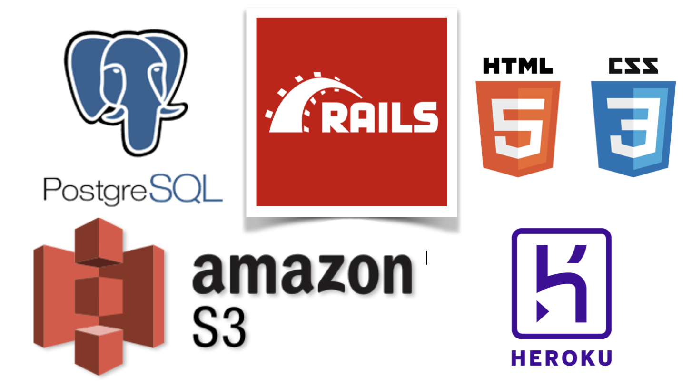

# T2A2 Marketplace Project
---

---

##### The 'Fancy Plants' Rails Application was developed by Carly Davis as part of the Coder Academy CLG Marketplace Project, Term 2 Assessment.

---

### Project Documentation

- ##### Github Repository
https://github.com/Carvis7/marketplaceapp

- ##### Trello Board
https://trello.com/b/DqN2ux5B/marketplace-app

- ##### Heroku Deployment Site
https://fierce-plateau-30702.herokuapp.com

- ##### Slide Deck
https://docs.google.com/presentation/d/1Z7QGJm5-rGMnyN3mqStdQTuRGx2bcfUGDpZENgkjJJ0/edit?usp=sharing

---

### Instructions 

To access the rails app, please visit the Heroku site by visiting https://fierce-plateau-30702.herokuapp.com.

The user can create an account, or alternatively, login using the following credentials:

###### User Details
Email: testuser@test.com
Password: password

---

## R7 & R8 - Identify the problem you are trying to solve by building this particular marketplace app. Why is it a problem that needs solving?

Horticulture related hobbies are on the uprise, and people are continually jumping on the bandwagon to own and raise plants due to the many health benefits. These benefits are both mental and physical.

Currently, plants can be purchased through nurseries and home depot stores such as Bunnings, or online through marketplace websites like Gumtree and Ebay.

Instead of having to traverse the listings of an online marketplace that also sells products of various other categories, and having to take a trip downtown to see what the local nursery or hardware store has in stock, I wanted to bring people to a place where there is nothing but the plants they are looking for to fill their home or office space.

I also wanted to reduce waste, as people who are moving can not simply take their plants to a store and trade them in, nor do the local goodwill shops take such items.

The Fancy Plants web app lets people connect and share with each other.
It is a cashed based system where people simple complete their transactions in real life after organising to inspect the plant they have purchased.

This process also allows the user to know exactly what they are paying for, when they are paying for it.

No more plants in the bin when you're moving house, or having to try to force them on unwiling neighbours, and no more scouring other sites looking for something that might not turn out to be what was advertised.

---

## My Marketplace App

The purpose of my app is to bring together plant enthusiasts and give them a platform to communicate and sell and purchase plants in an environment dedicated to that particular function.

The functionality and features of the app includes [but is not limited to...] :

- **User Accounts**
A user can sign in/sign up, update details, access the marketplace, sell products, buy products, and can converse with other sellers and/or buyers through an inbuilt chat system.
Users are also able to delete their accounts through the update link, if they are unhappy or have decided they have no use for the site.

- **Sign Up**
A user is able to access the marketplace without signing up, but are restricted to a 'look don't touch' basis.
The are unable to do anything but view the listings in the app.
Users can sign up using the form with their email, and can make a password (minimum 6 characters) to associate to that account.

- **Selling**
Users can sell plants of all sorts and are given options to even input the plants 'pot size'. This lets other users know how established the plant is, and whether or not it would be suitable for their home or office.
Once a plant has been purchase by another user, the listing is removed from the main marketplace, and the plant listing is updated in both the 'Sellers' dashboard and the 'Buyers' dashboard to reflect that the product has been purchased.

- **Buying**
Users are able to buy plants from the marketplace, and these plants will then be added to their dashboard. 
The seller will also have the plant moved to a 'sold' area in their user dashboard, and both parties are able to contact each other via the messenger.

- **Listings**
Plant listings contain information about the plant that is up for sale.
Information such as: The name of the plant, the size (pot size in cms), the variant (Whether the plant is a tree, edible, or a bush etc.), and of course, the price of the plant.
The listing also contains a photo, and it is not possible to post a listing that doesn't have an image file attached.
I did this for three reasons:
1. I wanted the user to be able to tell a plant by sight before having to read anything else associated to the listing. I believe this makes for a better user experience.
2. I didn't want a bunch of image-less listings.
3. The buyer is able to somewhat determine what state the plant is in before committing to buy the plant.

- **Messenger**
The inbuilt messaging system allows users to chat with one another about the listings, and organise the payment and handover of the product.
Users, before purchasing, are able to open chat sessions, and ask sellers questions pertaining to the product (plant) they are selling.

---

## My Tech Stack

---

## User Story

There are two types of users associated with the Fancy Plants rails app. They are:
- Buyer
- Seller

Only one account is needed to perform both of these functions.

The user stories are listed below.

As a Buyer, I want to:

- Create a Fancy Plants account.
- Have the ability to update my profile details.
- Browse the range of products for sale in the marketplace.
- View information about a specific product, including price and what the product is specifically (In this instance, what type of plant it is).
- Purchase a product.
- Ask a seller questions about the product. Both post and pre-purchase. As well as be able to organise a meet-up and exchange funds.
- Be able to view the products I have purchased in the past.

As a Seller, I would like to be able to:

- List the product I am wanting to sell, including price and other details.
- Edit and/or delete products that I am selling.
- Have the ability to communicate with customers after they have purchased one of my products.
- Be able to see what products I have listed have been sold.

---

## Schema Design and ERD

---

## Trello

https://trello.com/b/DqN2ux5B/marketplace-app

I used a Trello board to track my workflow and sectioned tasks into boards related to specific areas of my app such as design, production, and deployment; rather than setting specific tasks for days or weeks.

I wanted to build my app on a needs basis, and I work and think better if a specific task is carried out to the end before a new one is started.

The board reflects this.

I also abandoned some elements of the app I wanted to integrate in the beginning due to time restraints. These are noted in the Trello board.

---

## Wireframes

##### Web View

 

##### Mobile View

---

## high level components

The Fancy Plants rails application utilises the MVC rails architecture framework.
This framework works by sending certain jobs to different sections of the app such as the Model, Controllers, and the View.

The Model is linked to the database and contains the data for the application.
Its also contains the 'state' of the application such as what orders a customer has, and it also notifies the view of any state changes.
Models handle all the business logic within an app, and determine how each table is related to one another in your schema design.

The View generates the UI and pressents the data within the app to the user.
Views generally don't do any processing, and work with models to help determine what is displayed to the user. 
Views also work with stylesheets to help process any CSS contained within the app, if any.

Controllers recieve information from the user and send it back to the model for processing. Once processed, the model then communicates with the View and the information is then passed back to the user.
The Controller is a collection of methods that follow the CRUD (Create, Read, Update, Destroy) system.

Rails Routes dispatches URL's to a controllers action. It automatically generates paths for your app, thus eliminating the need to hard code strings into your Views.

---

## Third part servcies

##### Devise

Devise is a Rack based flexible authentication solution for Rails that is based on Warden. It is based on a modularity concept meaning that it only uses what is really needed.

##### AWS S3

##### Heroku

---
